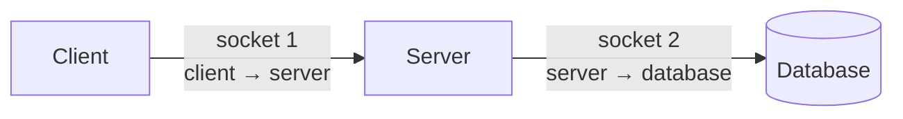
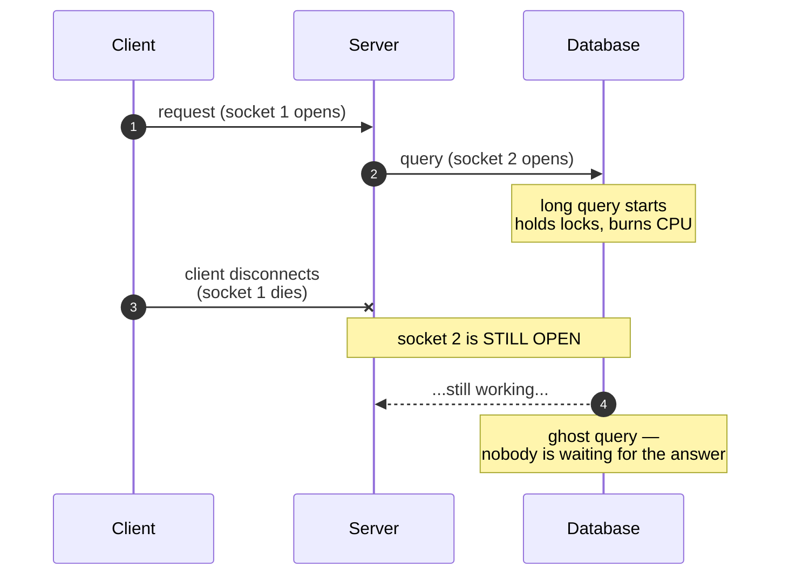
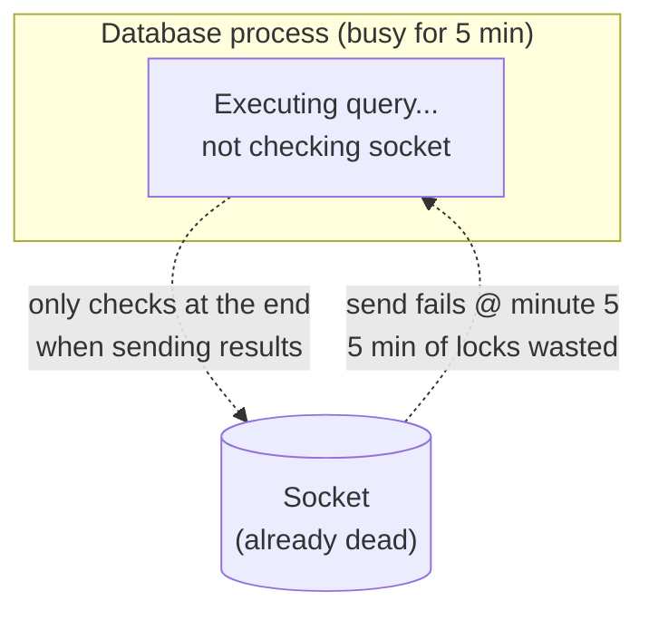
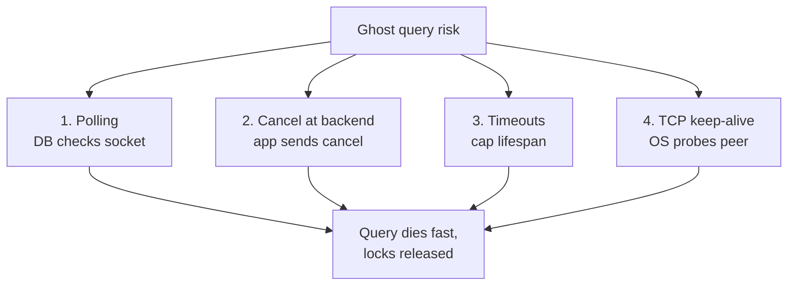
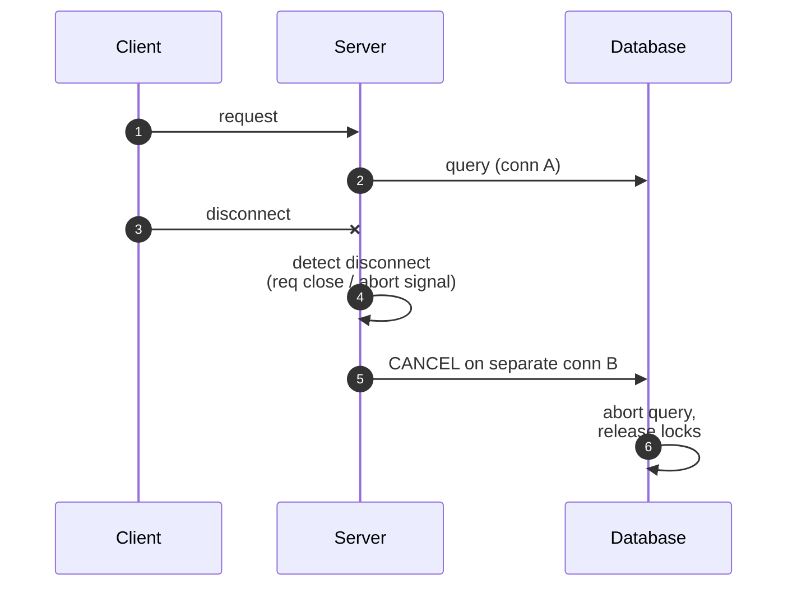

Whenever we make a request, it goes through a chain of separate connections downstream, which makes it hard to cancel the request mid-process. This becomes a real problem with long-running queries.



> Each `→` above is its own connection (socket). Even if the client-to-server socket dies, the server-to-database socket stays open unless we explicitly close it.

So the database keeps running the query for a client that no longer exists. This is called a <mark class="hl-red">ghost query</mark>. It can <mark class="hl-yellow">hold locks</mark>, use <mark class="hl-yellow">CPU and memory</mark>, block other transactions, and waste resources.



## The Root Cause

**1. Disconnections don't propagate on their own.** Nothing in TCP tells the database <mark class="hl-yellow">"the user who started this is gone."</mark> The backend has to notice and pass the cancellation along.

**2. Databases are busy and don't look at the socket.** A database process executing a query is focused on the query. It only touches the socket when it needs to read from or write to it, for example when it sends results back. If the query takes 5 minutes, the process may not discover the connection died until minute 5, when it tries to send the result and fails. Meanwhile, <mark class="hl-red">the work and the locks were all wasted.</mark>



## The Solution

There is no single fix, so <mark class="hl-green">layer several</mark>:



### 1. Polling (database side)

PostgreSQL 14+ has the setting `client_connection_check_interval`, which forces the process to check the socket periodically. If the client is gone, the query is aborted and locked resources are released. <mark class="hl-yellow">It only works on Linux.</mark>

```sql
-- Check the socket every 5 seconds during query execution
ALTER SYSTEM SET client_connection_check_interval = '5s';
SELECT pg_reload_conf();
```

### 2. Cancel at the backend

When the client disconnects, the backend should <mark class="hl-green">cancel the in-flight database query</mark>. Most modern database libraries support this through a cancellation or timeout context that sends a cancel request to the database over a separate connection. Without it, the backend just abandons the query and the database keeps running it.



```ts
// Node.js (pg) — cancel the query when the client goes away
req.on("close", () => {
  // pg: abort the in-flight query on this client
  void client.query("SELECT pg_cancel_backend($1)", [backendPid]);
});
```

```python
# Python (psycopg) — same idea
try:
    cur.execute(long_query)
except ClientDisconnected:
    conn.cancel()  # sends cancel over a separate connection
```

### 3. Timeouts as a safety net

Assume some ghosts will slip through and <mark class="hl-green">cap their lifespan</mark>:

- `statement_timeout`: limits how long any single query can run.
- `lock_timeout`: limits how long a query waits for a lock.
- `idle_in_transaction_session_timeout`: kills sessions that opened a transaction and then went silent.

```sql
ALTER DATABASE app SET statement_timeout = '30s';
ALTER DATABASE app SET lock_timeout = '5s';
ALTER DATABASE app SET idle_in_transaction_session_timeout = '1min';
```

### 4. TCP keep-alive

The OS sends periodic probes to detect dead peers. This only helps partially: <mark class="hl-yellow">detection can take a long time</mark> depending on settings, behavior differs across operating systems, and it doesn't make a busy database process stop working any sooner.

## When does this matter?

If queries finish in milliseconds (under ~500ms) then ghost queries are rarely a concern. The problem happens with <mark class="hl-red">long-running work</mark> like large ETL jobs, big reports, or queries stuck waiting on locks held by other transactions, where a single ghost can block other users and turn a small problem into a slowdown or even outages.

| Query shape | Ghost risk |
|---|---|
| `SELECT` in milliseconds | negligible |
| Big reports / ETL (seconds–minutes) | high — cancel + timeouts |
| Waiting on a lock | worst — one ghost blocks everyone |

---

*Credit: inspired by [this video](https://www.youtube.com/watch?v=ZrqgI5jQKqA).*
